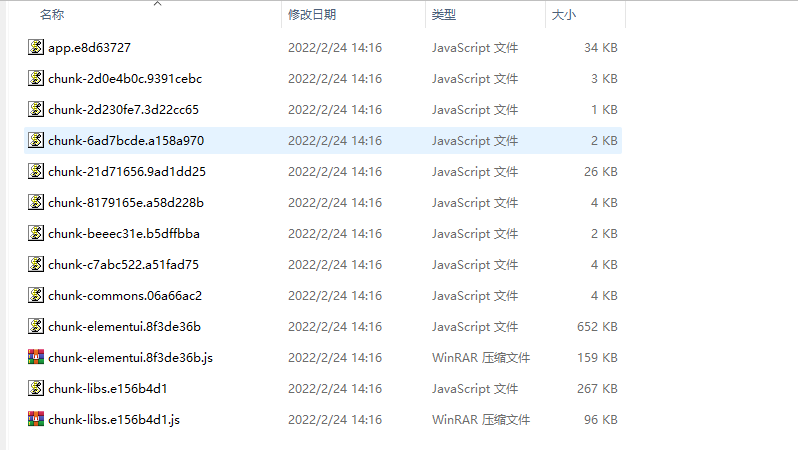

## 基础框架

:::tip 介绍
**:one:** &nbsp;该基础框架目前适用于后台系统，如果要在移动端网页或 PC 端(含 SEO)使用，则需要做一些调整，如 `适配` ，`Layout布局调整`，`修改UI库` 等

**:two:** &nbsp; `Element-UI` 自定义主题（[完整文档参考官网](https://element.eleme.cn/#/zh-CN/component/custom-theme) ），项目目前使用的是 `npm安装的依赖包，全局引入` 的模式，使用方式参考 [这里](/dir/#功能点)，如果觉得 npm 包安装太大，可以考虑使用 `cdn + 在线主题生成css` 的模式，在线主题地址参考 [官网](https://element.eleme.cn/#/zh-CN/theme)

**:three:** &nbsp;该基础框架基于 `vue-element-admin` ，在此基础上进行调整，可参考 [官方文档](https://panjiachen.github.io/vue-element-admin-site/zh/guide/)了解一些功能

**:four:** &nbsp;第三方依赖包和 Vue 的生态以及一些需要的基础技术

> [语法 —— vue](https://cn.vuejs.org/v2/guide/) \
> [路由 —— vue-router](https://cn.vuejs.org/v2/guide/) \
> [状态管理 —— vuex](https://vuex.vuejs.org/zh/) \
> [CSS —— vue-loader](https://vue-loader.vuejs.org/zh/) \
> [项目配置 —— vue-cli](https://cli.vuejs.org/zh/) \
> [配置基础知识 —— webpack](https://webpack.docschina.org/) \
> [Vue 规范 —— 风格指南](https://cn.vuejs.org/v2/style-guide/) \
> [ajax 请求 —— axios](http://www.axios-js.com/) \
> [函数逻辑处理 —— lodash](https://www.lodashjs.com/) \
> [日期处理 —— dayjs](https://dayjs.fenxianglu.cn/) \
> [UI 组件库 —— element-ui](https://element.eleme.cn/#/zh-CN) \
> [cookie 操作 —— js-cookie](https://www.npmjs.com/package/js-cookie) \
> [CSS —— Sass预处理器](https://www.sass.hk/) \
> [Javascript —— Es6教程](https://es6.ruanyifeng.com/#README)

**:five:** &nbsp;框架 cdn 使用了 `vue` `vue-router` `vuex` `axios` `lodash` 这五个，lodash 可以直接使用 **`_`** 调用方法

**:six:** &nbsp;打包文件支持 `gzip` 压缩（需要后端服务器支持），超过 100kb 的文件就会形成压缩文件

 

**:seven:** 添加了 `gitHooks`，`git commit` 提交时候会进行检查，不符合 `Eslint` 标准的不好提交代码

**:eight:** &nbsp;可删除目录文件，可修改目录文件

| 路径                    | 类型 |         说明          |                    行为                     |
| ----------------------- | :--: | :-------------------: | :-----------------------------------------: |
| /src/api/modules/table  | 目录 |   table 的接口 api    |                   可删除                    |
| /src/mock/modules/table | 目录 |    table mock 数据    |                   可删除                    |
| /src/views/form         | 目录 |     表单演示页面      |                   可删除                    |
| /src/views/table        | 目录 |    table 演示页面     |                   可删除                    |
| /src/api/modules/user   | 目录 |   用户信息相关 api    |                   可修改                    |
| /src/mock/modules/user  | 目录 |  用户信息 mock 数据   |                   可修改                    |
| /src/store/modules/user | 文件 | 用户信息 store 的操作 | 可修改  （配合[权限逻辑](/dir/#功能点)） |

:::
