# 项目目录文件说明

> 项目中的模块层次可参考项目左边的 **`Menu导航`**

## 一级目录/文件

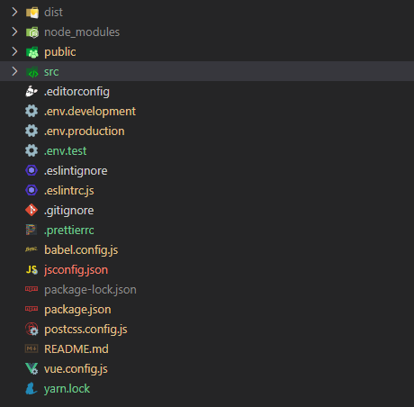

| 名称              | 类型 |                 说明                 |
| ----------------- | :--: | :----------------------------------: |
| dist              | 目录 |             打包后的文件             |
| node_modules      | 目录 |           依赖的第三方文件           |
| public            | 目录 | 静态文件目录，里面文件不会走 webpack |
| src               | 目录 |          项目业务开发主目录          |
| .editorconfig     | 文件 |            编辑器配置文件            |
| .env.development  | 文件 |          开发环境的环境变量          |
| .env.production   | 文件 |          生产环境的环境变量          |
| .env.staging      | 文件 |          测试环境的环境变量          |
| .eslintignore     | 文件 |          eslint 的忽略文件           |
| .eslintrc.js      | 文件 |          eslint 的配置文件           |
| .gitignore        | 文件 |            git 的忽略文件            |
| .prettierrc       | 文件 |         prettier 的配置文件          |
| babel.config.js   | 文件 |           babel 的配置文件           |
| jsconfig.json     | 文件 |       用于开发 Path 的智能识别       |
| package.json      | 文件 |         项目安装依赖配置文件         |
| postcss.config.js | 文件 |          posscss 的配置文件          |
| README.md         | 文件 |               简单介绍               |
| vue.config.js     | 文件 |          vue 项目的配置文件          |
| yarn.lock         | 文件 |          yarn 的 lock 文件           |

## src/\*\* 目录/文件

| 名称          | 类型 |                          说明                           |
| ------------- | :--: | :-----------------------------------------------------: |
| mock          | 目录 |              mockjs，用于无接口假数据处理               |
| api           | 目录 |                   存放接口 api 的方法                   |
| assets        | 目录 |        存放像 images 的静态文件(走 webpack 编译)        |
| components    | 目录 |         项目封装组件(common 通用组件+业务组件)          |
| directive     | 目录 |     vue 的 directive 指令(global 全局指令+局部指令)     |
| filters       | 目录 |               vue 的 filter 过滤器(全局)                |
| router        | 目录 |                        路由配置                         |
| store         | 目录 |              状态管理(可以理解为全局变量)               |
| styles        | 目录 |                        全局样式                         |
| utils         | 目录 |                         工具库                          |
| views         | 目录 |                        项目页面                         |
| App.vue       | 文件 |                      根部 vue 文件                      |
| main.js       | 文件 |                      项目入口文件                       |
| permission.js | 文件 |                    权限路由控制文件                     |
| settings.js   | 文件 | 项目应用配置(fixedHeader 头部悬浮，useMock 使用 mockjs) |

## src/mock/\*\* 接口文件

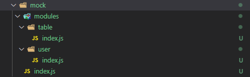
| 名称 | 类型 | 说明 |
| ----------------- | :--: | :----------------------------------: |
| modules | 目录 | 模块，该文件夹下根据业务区分接口模块，<br>可按照 `主模块/子模块(0 或多个)/index.js` 模式划分 |
| index.js | 文件 | mockjs 的配置入口文件 |
::: tip 使用方式：
**:one:** &nbsp;modules 模块划分好后，`某模块/index.js` 一般是入口文件，该模块下如果有其他的 js 最好汇总到 index.js 下，要不然 `注册模块` 不方便(**一般模块目录层次不超过三级**)

```js
-/user
  -/ index.js
  -/ detail.js
  -/ info.js

// index.js
import info from "./info";
import detail from "./detail";

export default [
  ...info,
  ...detail
]

```

**:one:** &nbsp;modules 下 <font color=red>**文件名/目录 要和 src/api/modules 对应**</font>，然后在 js 文件里面新建假数据（假数据规则详见[官网链接](http://mockjs.com/examples.html)）和 response

```js
// 文件：modules/table/index.js
import { Mock } from "@/mock";
// 这是Mock造数据的语法
const data = Mock.mock({
  "items|30": [
    {
      id: "@id",
      title: "@sentence(10, 20)",
      "status|1": ["published", "draft", "deleted"],
      author: "name",
      display_time: "@datetime",
      pageviews: "@integer(300, 5000)",
    },
  ],
});
// 返回一个json数组（多个请求），里面是对接口的拦截和返回的response
export default [
  {
    url: "/vue-admin-template/table/list",
    type: "get",
    response: () => {
      const items = data.items;
      return {
        code: 20000,
        data: {
          total: items.length,
          items: items,
        },
      };
    },
  },
];
```

```js
// 文件： modules/user/index.js
const tokens = {
  admin: {
    token: "admin-token",
  },
  editor: {
    token: "editor-token",
  },
};

const users = {
  "admin-token": {
    roles: ["admin"],
    introduction: "I am a super administrator",
    avatar:
      "https://wpimg.wallstcn.com/f778738c-e4f8-4870-b634-56703b4acafe.gif",
    name: "Super Admin",
  },
  "editor-token": {
    roles: ["editor"],
    introduction: "I am an editor",
    avatar:
      "https://wpimg.wallstcn.com/f778738c-e4f8-4870-b634-56703b4acafe.gif",
    name: "Normal Editor",
  },
};

export default [
  // user login
  {
    url: "/vue-admin-template/user/login",
    type: "post",
    response: (config) => {
      const { username } = config.body;
      const token = tokens[username];
      // mock error
      if (!token) {
        return {
          code: 60204,
          message: "Account and password are incorrect.",
        };
      }
      return {
        code: 20000,
        data: token,
      };
    },
  },
  // get user info
  {
    url: "/vue-admin-template/user/info.*",
    type: "get",
    response: (config) => {
      const { token } = config.query;
      const info = users[token];
      // mock error
      if (!info) {
        return {
          code: 50008,
          message: "Login failed, unable to get user details.",
        };
      }
      return {
        code: 20000,
        data: info,
      };
    },
  },
  // user logout
  {
    url: "/vue-admin-template/user/logout",
    type: "post",
    response: () => {
      return {
        code: 20000,
        data: "success",
      };
    },
  },
];
```

**:two:** &nbsp;到**index.js**去 `/src/mock/index.js` 注册模块，引入对应 `子模块下的入口文件index.js` 模块，然后赋值给 mocks

```js
// ...
import user from "./modules/user";
import table from "./modules/table";

const mocks = [...user, ...table];
// ...
```

:::

## src/api/\*\* 接口文件

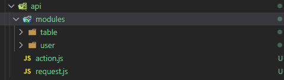
| 名称 | 类型 | 说明 |
| ---------- | :-----: | :-------------------------------------------------------------: |
| modules | 目录 | 基于业务模块的 api 请求文件，和 mock 的 modules 相对应，<br>可按照 `主模块/子模块(0 或多个)/index.js` 模式划分，`index.js` 是该模块的入口页面，**这里不需要把该模块其他页面汇总到 index.js** |
| action.js | 目录 | 基于 request.js 的封装，项目需要的请求方法文件，有 get,post 等，<br/>后期可补充 |
| request.js | 目录 | 接口请求 axios 的配置文件（地址前缀、请求响应拦截器等） |

```js
// 文件：api/action.js
import request from "./request";
// get请求
export function getAction(url, data) {
  return request({
    method: "get",
    url,
    params: data,
  });
}
// post请求
export function postAction(url, data) {
  return request({
    method: "post",
    url,
    data,
  });
}
```

```js
// 文件：api/modules/user/index.js
import { getAction, postAction } from "../action";

// 登录
export const login = (data) =>
  postAction("/vue-admin-template/user/login", data);
// 获取信息
export const getUserInfo = (data) =>
  getAction("/vue-admin-template/user/info", data);
// 登出
export const logout = (data) =>
  postAction("/vue-admin-template/user/logout", data);
```

:::tip 使用方式：
**:one:** &nbsp;引入在 src/api/modules 里面模块文件里的接口请求方法 \
**:two:** &nbsp;直接调用即可，方法执行返回的是 Promise

```js
import { getList } from "@api/modules/table"; // @api是别名，下面功能点有说明,index.js可以省略
methods: {
  fetchData() {
    this.listLoading = true;
    getList().then((response) => {
      this.list = response.data.items;
      this.listLoading = false;
    });
  },
},
```

:::

## src/assets/\*\* 静态文件

主要存放一些 **images 图片**，**fonts 字体**（推荐线上地址），**iconfont 图标**（推荐线上地址），**svg** 等静态的本地文件，走 webpack 编译流程

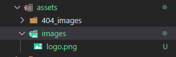
:::tip 说明：
**:one:** &nbsp;目前只有 images，如果要加别的种类的本地文件，可以根据需要新建文件夹 \
**:two:** &nbsp;images 下图片多的时候，可以考虑根据业务模块新建子级文件夹 \
**:three:** &nbsp;images 下的本地图片，最大大小不能超过 **100kb** ，大的推荐使用网络地址
:::

## src/components/\*\* 自定义组件

项目组件库文件夹，通用组件都在这个文件夹里面定义

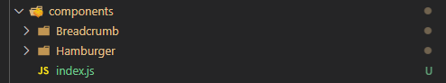

| 名称            | 类型 |                                     说明                                     |
| --------------- | :--: | :--------------------------------------------------------------------------: |
| \*\* /index.vue | 目录 |                       组件名目录，遵循 PascalBase 风格                       |
| index.js        | 文件 | 入口文件，将 components 下组件自动注册为全局组件，<br>无需再 import 引入注册 |

:::tip 说明：
**:one:**&nbsp;components 下的规则可参考 [components 文件夹下的子文件夹+\*.vue 的文件命名](/standard/#命名) \
**:two:**&nbsp;一个组件可分两部分，主组件和辅助文件，主组件即入口就是 <code>**index.vue**</code> ,而辅助组件(**\*\.vue，\*\.js 等**)就是用于拆分主组件结构逻辑，防止全部放在主组件入口，导致该文件太复杂不易维护 \
:::

:::tip 使用方式：
**:one:** &nbsp;全局注册的组件名是<font color=red>**E+index.vue 的上一级目录名(组件名)**</font>，E 表示
efreight \
**:two:** &nbsp;在 `<template></template>` 里面使用时候，将 **`PascalBase`** 风格的全局注册的组件名变成 **`kebab-case`** 风格的标签

```vue
<e-hamburger
  :is-active="sidebar.opened"
  class="hamburger-container"
  @toggleClick="toggleSideBar"
>
</e-hamburger>

<e-breadcrumb class="breadcrumb-container"></e-breadcrumb>
```

:::

## src/directive/\*\* 指令

项目的 vue 自定义指令，如 v-permission，不知道怎么自定义指令，可参考[官方文档](https://cn.vuejs.org/v2/guide/custom-directive.html)

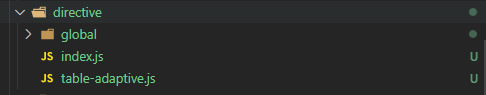

| 名称     |      类型       |                      说明                      |
| -------- | :-------------: | :--------------------------------------------: |
| global   |      目录       |               全局自定义指令目录               |
| \*\*     | 目录/文件，文件 |  局部自定义指令的 js 文件，使用时需要引入注册  |
| index.js |      文件       | 入口文件，配置 global 里的 js 自动注册全局指令 |

:::warning 说明：
**:one:**&nbsp;global 下只能有 js 文件，不能有子级目录，js 文件名字就是指令的名字,如 v-permission \
**:two:**&nbsp;**src/directive/0 或多个子目录/js** 都是局部指令，使用时候先引入，然后在 directives 进行注册，key 就是指令的名字
:::
:::tip 指令使用：
**:one:**&nbsp;global 全局：

```vue
<el-button v-permission="['editor']" type="primary">创建</el-button>
```

**:two:**&nbsp;局部：

```vue
<template>
  <div class="app-container">
    <el-table v-table-adaptive="{ bottomOffset: 50 }" :data="list" height="0px">
      ...
    </el-table>
  </div>
</template>

<script>
import tableAdaptive from "@/directive/table-adaptive"; // 引入
export default {
  // 局部注册
  directives: {
    tableAdaptive,
  },
};
</script>
```

:::

## src/filters/index.js 全局过滤器

项目的 vue 自定义过滤器，不知道怎么自定义过滤器，可参考[官方文档](https://cn.vuejs.org/v2/guide/filters.html)
:::warning 说明：
**:one:**&nbsp;index.js 的里面所有 export 导出的方法都会注册为全局自定义指令 \
**:two:**&nbsp;自定义指令的名称就是 export 导出的方法名
:::
:::tip 定义文件 index.js：

```js
/**
 * @Date: 2022-02-10 15:41:03
 * @Desc: 10000 => "10,000"
 * @Return: 转化后的值
 * @Author: lujie
 */
export function toThousandFilter(num) {
  return (+num || 0)
    .toString()
    .replace(/^-?\d+/g, (m) => m.replace(/(?=(?!\b)(\d{3})+$)/g, ","));
}
```

:::
:::tip 使用方法：

```vue
<template>
  <div class="dashboard-container">
    <p>{{ "123456789" | toThousandFilter }}</p>
  </div>
</template>
```

:::

## src/router/index.js 路由

如果不了解 vue 的路由 vue router，可参考[官方文档](https://router.vuejs.org/zh/)
:::tip <font color=red>路由参数的说明</font><Badge text="重要" />

```js
{
  hidden: true; // 设置 true 的时候该路由不会在侧边栏出现 如401，login等页面

  // 当你一个路由下面的 children 声明的路由大于1个时，自动会变成嵌套的模式--如组件页面
  // 只有一个时，会将那个子路由当做根路由显示在侧边栏--如引导页面
  // 若你想不管路由下面的 children 声明的个数都显示你的根路由
  // 你可以设置 alwaysShow: true，这样它就会忽略之前定义的规则，一直显示根路由
  alwaysShow: true;
  redirect: "noRedirect"; //当设置 noRedirect 的时候该路由在面包屑导航中不可被点击
  name: "router_name"; // 设定路由的名字,vue-router的name,尽量要填写
  meta: {
    roles: ["admin", "editor"]; // 设置该路由进入的权限，支持多个权限叠加,角色
    title: "title"; // 设置该路由在侧边栏和面包屑中展示的名字
    icon: "el-icon-x"; // 设置该路由的图标
    breadcrumb: false; //  如果设置为false，则不会在breadcrumb面包屑中显示(默认 true)
    affix: true; // 如果设置为true，它则会固定在tags-view中(默认 false)

    // 当路由设置了该属性，则会高亮相对应的侧边栏。
    // 这在某些场景非常有用，比如：一个文章的列表页路由为：/article/list
    // 点击文章进入文章详情页，这时候路由为/article/1，但你想在侧边栏高亮文章列表的路由，就可以进行如下设置
    activeMenu: "/example/list";
  }
}
```

:::
:::tip index.js 解析：
**:one:**&nbsp;静态路由，一般放首页和一些功能性的路由，不需要接口权限控制的

```js
export const constantRoutes = [
  // redirect/**格式的路由
  {
    path: "/redirect",
    component: Layout,
    hidden: true,
    children: [
      {
        path: "/redirect/:path(.*)",
        component: () => import("@/views/redirect"),
      },
    ],
  },
  // 登录
  {
    path: "/login",
    name: "login",
    component: () => import("@/views/login"),
    hidden: true,
  },
  // 404页面
  {
    path: "/404",
    component: () => import("@/views/404"),
    hidden: true,
  },
  // 首页
  {
    path: "/",
    component: Layout,
    redirect: "/dashboard",
    children: [
      {
        path: "dashboard", // 这个path不要改变，涉及到Breadcrumb组件
        name: "dashboard", // 这个name不要改变，涉及到TagsView和Breadcrumb组件
        component: () => import("@/views/dashboard"),
        meta: { title: "首页", icon: "el-icon-s-home", affix: true },
      },
    ],
  },
];
```

**:two:**&nbsp;动态路由，一般都是从接口请求那边获取，权限控制(这里随便几个做例子)，然后 addRoutes 进行添加

```js
export const asyncRoutes = [
  {
    path: "/example",
    component: Layout,
    redirect: "/example/table",
    name: "example",
    meta: { title: "表格举例", icon: "el-icon-s-operation", roles: ["admin"] },
    children: [
      {
        path: "table",
        name: "example_table",
        component: () => import("@/views/table"),
        meta: { title: "表格", icon: "el-icon-s-grid" },
      },
      {
        path: "table2",
        name: "example_table2",
        component: () => import("@/views/table"),
        meta: { title: "表格2", icon: "el-icon-s-grid" },
      },
    ],
  },
  {
    path: "/form",
    component: Layout,
    name: "form",
    children: [
      {
        path: "edit",
        name: "form_edit",
        component: () => import("@/views/form/edit"),
        meta: { title: "表单", icon: "el-icon-tickets", roles: ["editor"] },
      },
    ],
  },
  {
    path: "external-link",
    component: Layout,
    children: [
      {
        path: "https://panjiachen.github.io/vue-element-admin-site/#/",
        meta: { title: "外链", icon: "el-icon-male" },
      },
    ],
  },

  // 这个放在最后，路由匹配不到，跳转404
  { path: "*", redirect: "/404", hidden: true },
];
```

**:three:**&nbsp;创建路由，重置路由

```js
// 创建路由
const createRouter = () =>
  new Router({
    // mode: 'history', // require service support
    scrollBehavior: () => ({ y: 0 }),
    routes: constantRoutes,
  });

const router = createRouter();

// Detail see: https://github.com/vuejs/vue-router/issues/1234#issuecomment-357941465
// 重置路由，用于解决addRoutes多次调用产生错误的问题
export function resetRouter() {
  const newRouter = createRouter();
  router.matcher = newRouter.matcher; // reset router
}
```

:::

## src/store/\*\* 状态机制(全局变量)

如果不了解 vue 的状态管理 vuex，可参考[官方文档](https://vuex.vuejs.org/zh/)

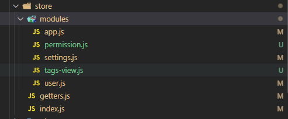
| 名称 | 类型 | 说明 |
| -------- | :-------------: | :--------------------------------------------: |
| modules | 目录 | 模块目录 |
| getters.js | 文件 | store 的 root 的 getters 文件 |
| index.js | 文件 | store 的入口定义文件,实现了 modules 的自动注入，不需要再 import 模块 |
:::warning modules 说明：
**:one:**&nbsp;app.js 应用级别的状态处理(sidebar 的控制) \
**:two:**&nbsp;permission.js 权限路由的状态处理(routes 的控制) \
**:three:**&nbsp;setting.js 应用的设置(如 fixedHeader，header 是否悬浮) \
**:four:**&nbsp;tags-view.js tagsView 的状态处理 \
**:five:**&nbsp;user.js 用户信息的状态处理(如 token，name，roles 等)

:::

## src/styles/\*\* 全局样式(sass 文件)

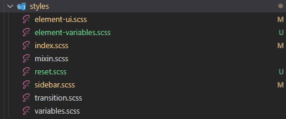
| 名称 | 类型 | 说明 |
| -------- | :-------------: | :--------------------------------------------: |
| element-variables.scss | 文件 | elementui 的自定义主题文件(改变 sass 变量) |
| element-ui.scss | 文件 | 用于覆盖默认的 elemenui 库样式的文件，用于补充自定义主题 |
| mixin.scss | 文件 | sass 的 mixin 混入文件 |
| reset.scss | 文件 | 初始化样式，解决浏览器的一些默认样式的问题 |
| sidebar.scss | 文件 | 项目左边的导航 menu 样式，<br>覆盖了部分默认的 elemenui menu 的样式 |
| transition.scss | 文件 | 动画样式 |
| variables.scss | 文件 | sass 样式变量，用于集中控制样式 |
| index.scss | 文件 | 样式入口文件,包括了<br>element_ui,mixin,reset,transition,variables,sidebarya |

## src/utils/\*\* 工具库

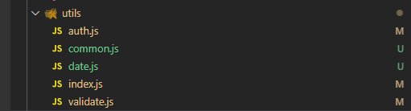

| 名称        | 文件 |               说明               |
| ----------- | :--: | :------------------------------: |
| auth.js     | 文件 |        cookie 的通用方法         |
| common.js   | 文件 |        通用逻辑处理的方法        |
| date.js     | 文件 | 日期处理的通用方法，引入了 dayjs |
| validate.js | 文件 |    验证方法，通常是正则表达式    |
| index.js    | 文件 |   入口文件，方便上述方法的使用   |

:::warning 使用方法：
**:one:**&nbsp;index.js 定义：

```js
// 文件的引入
import * as common from "./common";
import * as date from "./date";
import * as validate from "./validate";

// 模块的导出
export { common, date, validate };
```

**:two:**&nbsp;date.js 定义：

```js
const dayjs = require("dayjs");

// 获取当前年
export function getNowYear() {
  return parseInt(dayjs().year());
}

// 获取当前时间
export function getNowTime() {
  return dayjs().format("YYYY-MM-DD HH:mm:ss");
}
```

**:three:**&nbsp;页面使用：

```vue
<template>
  <div class="dashboard-container">
    <div class="dashboard-text">时间：{{ time }}</div>
  </div>
</template>

<script>
import { date } from "@u/index"; // @u是别名，参考下面的功能点

export default {
  data() {
    return {
      time: date.getNowTime(),
    };
  },
};
</script>
```

:::

## src/views/\*\* 页面

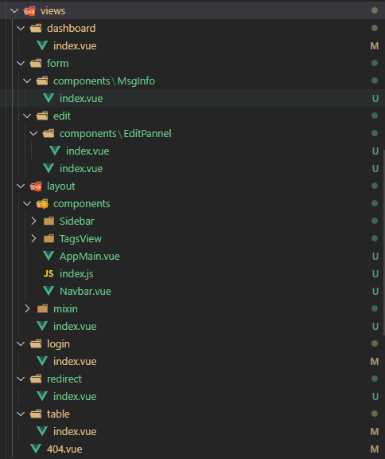

| 名称      | 文件 |                  说明                   |
| --------- | :--: | :-------------------------------------: |
| dashboard | 目录 |                  首页                   |
| login     | 目录 |                  登录                   |
| layout    | 目录 | 项目布局(左边导航+上面 Header+tag 路由) |
| redirect  | 目录 | redirect 跳转，参考路由 redirect 的匹配 |
| 404.vue   | 目录 |         404 没有找到对应的页面          |
| \*\*      | 目录 |      业务模块(table 和 form 都是)       |

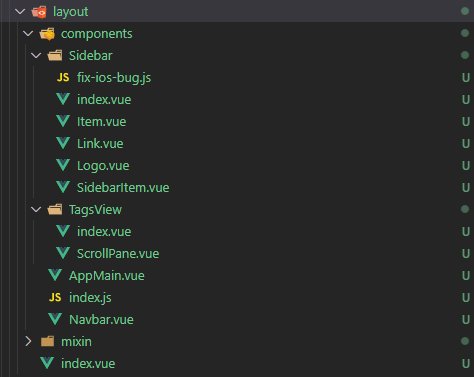

| 名称                   | 类型 |                         说明                         |
| ---------------------- | :--: | :--------------------------------------------------: |
| components             | 目录 |            当前 layout 布局模块的组件目录            |
| components/Sidebar     | 目录 |                 项目左侧的导航 menu                  |
| components/Navbar.vue  | 文件 |          项目 menu 的右侧区域的头部 header           |
| components/TagsView    | 目录 |       项目 menu 的右侧区域头部下面的 tag 路由        |
| components/AppMain.vue | 文件 |            项目 menu 的右侧区域的内容部分            |
| components/index.js    | 文件 |       入口文件，将 components 内的多个组件导出       |
| layout/mixin           | 目录 | 工具文件，混入，页面 resize 时候 控制 SideBar 的变化 |
| layout/index.vue       | 文件 |                  布局模块的入口文件                  |

:::tip 说明：
**:one:**&nbsp;命名规则 可参考 [命名规则](/standard/#命名)  
**:two:**&nbsp;components 的规则 可参考 [components 文件夹下的子文件夹-说明 2,3](/standard/#命名) \
**:three:**&nbsp;业务组件划分都按照**主模块/子模块(0 或多个)/页面名/index.vue**进行划分 \
**:four:**&nbsp;模块下的入口页面用 **index.vue** ,从入口页面跳转到的其他的页面就用其他的名字，比如 **Detail.vue,Add.vue,Edit.vue**
:::

## 功能点

**:one:**&nbsp;别名 alias, 用于路径的 import 引入，比如 import MsgWrap from "@comp/form/main/MsgWrap";

```js
configureWebpack: {
  name: name,
  resolve: {
    alias: {
      "@": resolve("src"),
      "@comp": resolve("src/components"),
      "@u": resolve("src/utils"),
      "@img": resolve("src/assets/images"),
      "@v": resolve("src/views"),
      "@api": resolve("src/api"),
    },
  }
},
```

**:two:**&nbsp;权限路由，src/permission.js
:::warning 说明：

1. 使用 vue router 的导航守卫 router.beforeEach，进入每个页面之前进行判断
2. 先判断 hasToken，如果没有 token，进入到 login 登录页面
3. 有 token 情况下，获取状态管理 store 里面的 roles，如果 roles.length > 0，就直接进入页面
4. 如果获取不到 roles，调用接口，获取用户数据，获取动态路由，用 router.addRoutes 添加路由，进入页面
   :::
   <font color=red>**上述的权限逻辑，可以根据具体项目进行相应的调整**</font>

**:three:**&nbsp;自定义主题( **修改 elementui 库的默认样式** ) @/styles/element_variables.scss
:::tip 说明：

1. 下面具体的 sass 变量可以参考 [官方文档](https://github.com/ElementUI/theme-chalk/blob/master/src/common/var.scss)
2. 主题色操作可以参考 [官方文档](https://element.eleme.cn/#/zh-CN/theme)
   :::

```scss
/* 自定义主题色 elementui */
// 主题色变量
$--color-primary: #ff4949;
$--color-success: #13ce66;
$--color-warning: #ffba00;
$--color-danger: #1890ff;

$--button-font-weight: 400; // 按钮字体font-weight

$--table-border: 1px solid #dfe6ec; // table表格border

/* icon font path, required */
$--font-path: "~element-ui/lib/theme-chalk/fonts";

@import "~element-ui/packages/theme-chalk/src/index";

// 导出方便其他地方使用
:export {
  theme: $--color-primary;
}
```

**:four:**&nbsp;directives 指令

```js
// global/permission.js 全局指令 作用：局部权限
function checkPermission(el, binding) {
  const { value } = binding;
  const roles = store.getters && store.getters.roles; // 用户的角色

  if (value && value instanceof Array) {
    if (value.length > 0) {
      const permissionRoles = value;

      // 判断指令里面的内容角色是否和用户的角色有重叠，没有重叠就表示没有权限
      const hasPermission = roles.some((role) => {
        return permissionRoles.includes(role);
      });

      if (!hasPermission) {
        // 无权限，就删除该dom，不展示
        el.parentNode && el.parentNode.removeChild(el);
      }
    }
  } else {
    throw new Error(`need roles! Like v-permission="['admin','editor']"`);
  }
}
```

```js
// table-adaptive.js 局部指令 作用：设置table的高度，
// 去除（自定义设置的bottomOffset+表格上面的距离），然后充满

import {
  addResizeListener,
  removeResizeListener,
} from "element-ui/src/utils/resize-event";

/**
 * 怎样使用
 * <el-table height="0px" v-局部指令名="{bottomOffset: 30}">...</el-table>
 * el-table height 必须设置
 * bottomOffset: 30(default)   // 距离页面底部的长度
 */

const doResize = (el, binding, vnode) => {
  const { componentInstance: $table } = vnode;

  const { value } = binding;

  if (!$table.height) {
    throw new Error(`el-$table must set the height. Such as height='0px'`);
  }
  const bottomOffset = (value && value.bottomOffset) || 30;

  if (!$table) return;

  // 计算高度
  const height =
    window.innerHeight - el.getBoundingClientRect().top - bottomOffset;
  $table.layout.setHeight(height);
  $table.doLayout();
};

export default {
  bind(el, binding, vnode) {
    el.resizeListener = () => {
      doResize(el, binding, vnode);
    };
    // parameter 1 is must be "Element" type
    addResizeListener(window.document.body, el.resizeListener);
  },
  inserted(el, binding, vnode) {
    doResize(el, binding, vnode);
  },
  update(el, binding, vnode) {
    doResize(el, binding, vnode);
  },
  unbind(el) {
    removeResizeListener(window.document.body, el.resizeListener);
  },
};
```
