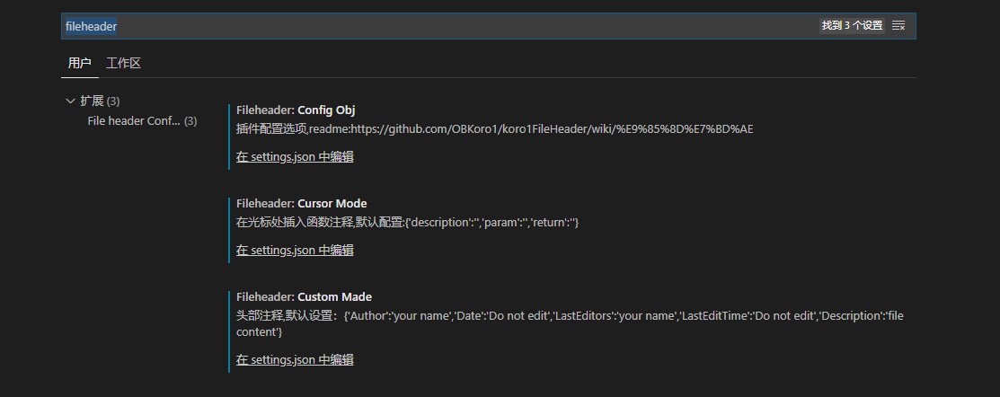

# 前端开发工具 VsCode

## 下载

- [官网](https://code.visualstudio.com/)

## 需要安装的插件

- Auto Close Tag —— 自动添加 HTML/XML 结束标签
- Auto Rename Tag —— 自动重命名成对的 HTML/XML 标记
- ESLint —— 代码检查
- koroFileHeader —— 函数注释
- Prettier —— 代码风格
- Vetur —— vue 官方插件
- JavaScript (ES6) code snippets —— ES6 语法智能提示
- HTML CSS Support —— HTML id 和类属性补全
- Bracket Pair Colorizer —— 成对的括号做颜色区分
- vscode-icons —— 目录树图标主题
- Path Intellisense —— 自动提示文件路径，支持各种快速引入文件 (配合下面 jsconfig.json)

```js
// jsconfig.json // 用于识别@sass这种别名，进行路径智能提示
{
  "compilerOptions": {
    "baseUrl": "./",
    "paths": {
      "@/*": ["src/*"],
      "@img/*": ["src/assets/images/*"],
      "@comp/*": ["src/components/*"],
      "@u/*": ["src/utils/*"],
      "@v/*": ["src/views/*"],
      "@api/*": ["src/api/*"]
    },
    "target": "ES6",
    "module": "commonjs",
    "allowSyntheticDefaultImports": true
  },
  "include": ["src/**/*"],
  "exclude": ["node_modules", "dist"]
}

```

## 插件安装步骤


::: tip 说明
**:one:** 进入到 Vscode 的扩展中，搜索需要的插件的名字 \
**:two:** 点击安装即可 \
**:three:** 当搜索框为空时，会出现已安装的插件列表
:::

## Eslint 的 Vscode 快捷键配置

**:one:** 打开 Vscode 的 文件 → 首选项 → 键盘快捷方式 \
**:two:** 输入 eslint，进行搜索，找到 `ESLint: fix all`，如下图


**:three:** 双击，然后设置快捷键，回车即可，推荐 `ctrl+shift+/`


**:four:** 最后，进入页面，按住设置的快捷键，就能 `一键Eslint格式化` ，如下图可打开 `Eslint或者Prettier`


## Vscode 的功能点

**:one:** `代码段` 的配置，设置好了之后，输入快捷键回车，自动生成自定义的代码段
::: tip 步骤

1. 创建 `代码片段`，去 [该网站](https://snippet-generator.app/) 转化，需要的是转化后的 body 里面的内容

```vue
<!--左边是要转化的代码，如下面-->

<template>
  <div></div>
</template>

<script>
export default {
  data() {
    return {};
  },
  components: {},
  methods: {},
};
</script>

<style lang="scss" scoped></style>
```

```js
// 转化后的内容如下，需要的是body里面的内容

"": {
  "prefix": "",
  "body": [
    "<template>",
    "  <div></div>",
    "</template>",
    "",
    "<script>",
    "export default {",
    "  data() {",
    "    return {};",
    "  },",
    "  components: {},",
    "  methods: {},",
    "};",
    "</script>",
    "",
    "<style lang=\"scss\" scoped></style>"
  ],
  "description": ""
}
```

2. 打开 Vscode 的 文件 → 首选项 → 用户片段 → 搜索 vue → 在下面的 `vue.json` 双击进入，然后编辑 `代码片段`，将上一步获取的内容放到 body 即可，其中 prefix 的内容 `lvue` 就是自动生成代码的指令

```json
// vue.json 下面的指令就是lvue，会自动生成代码

{
  "lvue": {
    "prefix": "lvue",
    "body": [
      "<template>",
      "  <div></div>",
      "</template>",
      "",
      "<script>",
      "export default {",
      "  data() {",
      "    return {};",
      "  },",
      "  components: {},",
      "  methods: {},",
      "};",
      "</script>",
      "",
      "<style lang=\"scss\" scoped></style>"
    ],
    "description": "lvue base"
  }
}
```

:::

**:two:** `koroFileHeader` 的使用，快捷键生成自定义的注释内容
::: tip 步骤

1. 打开 Vscode 的 文件 → 首选项 → 设置 → 搜索 fileheader → 在下面的 `setting.json` 里面随便点击一个进入



2. 在 `setting.json` 配置自定义的注释格式，头部注释这边关闭掉

```js
{
  // 文件头部注释关闭
  "fileheader.customMade": {
    "autoAdd": false
  },
  //函数注释 Do not edit表示会自动生成
  "fileheader.cursorMode": {
    "Date": "Do not edit",
    "Desc": "",
    "Return": "",
    "Author": "lujie",
  }
}
```

:::

- 使用方法：
  > <font color=green>**ctrl+win+t**</font> 快捷键自动生成函数注释，对应上面的 fileheader.cursorMode

**:three:** git 的使用


## Vscode 中文简体的配置

**:one:** `Ctrl+Shift+P` 快捷键打开搜索 ，输入 `configure Language` ，单击 `Configure Diaplay Language`


**:two:** 选择语言，或者安装其他语言，`zh-cn` 表示中文简体


**:three:** 如果没有直接进入扩展，就进入扩展，搜索 `Chinese` , 然后选择下面的包进行安装，重启编辑器即可


